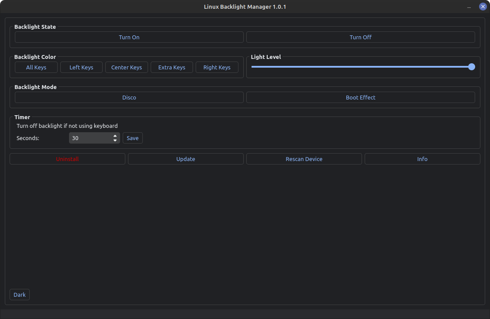

# Linux Backlight Manager



## Info
Is a program to manage your laptop keyboard backlights in linux.
Tested on Tuxedo / Clevo / Monste models. Must be tested on other devices

[Used Kernel](https://github.com/tuxedocomputers/tuxedo-keyboard)

## Installation
download lasted Release from [here](https://github.com/blueboy-tm/LinuxBacklightManager/releases)
after extract:
```shell
chmod +x installer
sudo ./installer
```

## Update
Uninstall old version and install new release

## Source Code
+ Requirements:
    - Python 3.7+
    - [PyQt5](https://pypi.org/project/PyQt5/)
    - [wget](https://pypi.org/project/wget/)
    - [pyinstaller](https://pypi.org/project/pyinstaller/) (for compile)

## Compile the code
after install requirements open SourceCode/compile directory :
first:
```shell
bash appcompile
```
second:
```shell
bash installercompile
```
